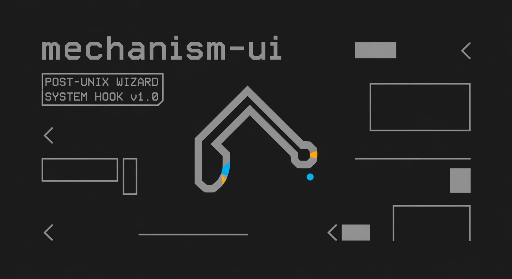

# mechanism-ui



**A strict rule for headless React, and a working demo that follows it.**

**→ Live demo: https://demo-summerjam.vercel.app**

The hook is the engine. The component is just the terminal.

## What this is

Two things, no more:

1. **`SKILL.md`** — a strict rule you can hand to Claude / Cursor / any agent, requiring every React component to split *mechanism* (hooks) from *policy* (render). One file. Drop it in and it changes how the agent writes UI.
2. **`demo/`** — a Next.js 16 app that demonstrates the rule with five hooks under `demo/hooks/`: `useDisclosure`, `useTabs`, `useCombobox`, `useAccordion`, `useDataTable`, plus `useCopyToClipboard` powering the copy buttons. These are reference implementations, not a published component library.

There is no `mechanism-ui` package on npm. If you want the hooks, copy them from `demo/hooks/`.

## The rule

> Separate policy from mechanism; separate interfaces from engines.
> — Eric S. Raymond

All state, derived values, event handlers, side effects, and ARIA wiring live in a custom hook (`mechanism`). The render layer (`policy`) contains only markup, classes, DOM structure, and element choice.

No `useState` in components. No inline handlers. No state-derived logic in render. Full self-check in [`SKILL.md`](./SKILL.md).

## Install the skill

```bash
npx headless-component
```

Writes `SKILL.md` to `.claude/skills/headless-component/SKILL.md` in your project, then reload Claude Code. Pass `--force` to overwrite an existing copy.

Or just drop [`SKILL.md`](./SKILL.md) into your repo manually and point your coding agent at it.

## Run the demo

```bash
cd demo
npm install
npm run dev
```

`demo/app/page.tsx` is a Server Component that reads the hook source files at request time and passes them to a client orchestrator. The sidebar uses `useTabs` for navigation, so the demo *of* the rule is itself written *under* the rule.

## What's in the repo

```
SKILL.md                              The rule. Drop into any project.
packages/headless-component/          npm package wrapping the installer.
  SKILL.md                            Symlink → ../../SKILL.md
  bin/install.js                      Installer invoked by `npx headless-component`.
demo/                                 Next.js 16 + React 19 app.
  app/page.tsx                        Server Component, reads hooks/*.ts.
  app/demo-app.tsx                    Client orchestrator. Uses useTabs.
  hooks/                              Six reference hooks.
prompts/generation-prompts.md         Prompts used to bootstrap the hooks.
```

## Philosophy

Engines outlive interfaces. Bake the UI into the logic and every design change forces a rewrite. Keep the mechanism pure and the terminal stupid.

## License

MIT
